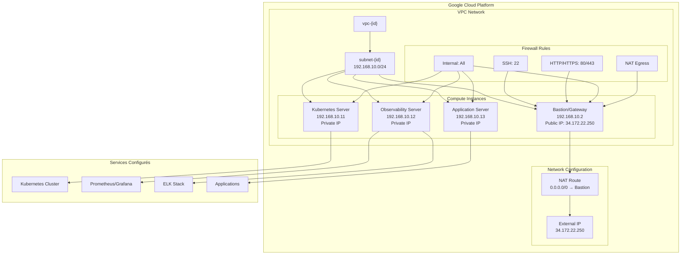

# Observabilité Infrastructure - Terraform

[](https://terraform.io)
[](https://cloud.google.com)
[](https://kubernetes.io)
[](https://www.ansible.com)

## 📋 Vue d'ensemble

Ce projet Terraform déploie une infrastructure d'observabilité complète sur Google Cloud Platform avec 4 serveurs Ubuntu configurés pour Kubernetes, monitoring, et applications. L'infrastructure inclut un réseau VPC privé avec un bastion host, des règles de pare-feu sécurisées, et une configuration NAT pour l'accès Internet depuis les serveurs privés.

## 🏗️ Architecture



## 🎓 Guide pour débutants

### 📋 Préparation de l'environnement GCP

#### 1. Créer un compte Google Cloud Platform

1. **Aller sur** [Google Cloud Console](https://console.cloud.google.com/)
2. **Se connecter** avec n'importe quelle adresse email Google
3. **Accepter** les conditions d'utilisation
4. **Créer un nouveau projet** ou utiliser le projet par défaut

#### 2. Activer les crédits gratuits

1. **Aller dans** "Facturation" dans la console GCP
2. **Activer la facturation** (nécessaire même pour les crédits gratuits)
3. **Utiliser les crédits gratuits** : Google offre $300 de crédits pour 90 jours
4. **Vérifier les quotas** : Les crédits gratuits couvrent largement ce projet

#### 3. Créer un compte de service

1. **Aller dans** "IAM et administration" > "Comptes de service"
2. **Créer un compte de service** :
   - Nom : `terraform-admin`
   - Description : `Compte de service pour Terraform`
3. **Attribuer les rôles** :
   - `Propriétaire` (ou `Éditeur` + `Compute Admin`)
   - `Service Account User`
4. **Créer une clé JSON** :
   - Cliquer sur le compte de service
   - Onglet "Clés" > "Ajouter une clé" > "Créer une nouvelle clé"
   - Type : JSON
   - **Télécharger** le fichier JSON

#### 4. Configurer l'authentification

1. **Renommer** le fichier téléchargé en `key.json`
2. **Placer** le fichier à la racine du projet :
   ```
   observability/
   ├── key.json          ← Votre fichier de clés
   ├── README.md
   ├── terraform/
   └── ansible/
   ```

### 💻 Préparation de l'environnement local

#### Option 1 : Machine Linux (Recommandée)

1. **Installer une VM Linux** :
   - Ubuntu 20.04+ ou CentOS 8+
   - 2 vCPU, 4GB RAM minimum
   - Accès SSH activé

2. **Se connecter en SSH** :
   ```bash
   ssh utilisateur@ip-de-votre-vm
   ```

3. **Installer Terraform** :
   ```bash
   # Ubuntu/Debian
   wget -O- https://apt.releases.hashicorp.com/gpg | gpg --dearmor | sudo tee /usr/share/keyrings/hashicorp-archive-keyring.gpg
   echo "deb [signed-by=/usr/share/keyrings/hashicorp-archive-keyring.gpg] https://apt.releases.hashicorp.com $(lsb_release -cs) main" | sudo tee /etc/apt/sources.list.d/hashicorp.list
   sudo apt update && sudo apt install terraform
   
   # Vérifier l'installation
   terraform version
   ```

4. **Installer Ansible** :
   ```bash
   # Ubuntu/Debian
   sudo apt update
   sudo apt install ansible
   
   # Vérifier l'installation
   ansible --version
   ```

#### Option 2 : Windows avec WSL2

1. **Installer WSL2** :
   ```powershell
   wsl --install
   ```

2. **Installer Terraform et Ansible dans WSL** :
   ```bash
   # Dans WSL Ubuntu
   sudo apt update
   sudo apt install terraform ansible
   ```

#### Option 3 : Cloud Shell (Google Cloud)

1. **Ouvrir Cloud Shell** dans la console GCP
2. **Terraform est pré-installé** dans Cloud Shell
3. **Installer Ansible** :
   ```bash
   sudo apt update
   sudo apt install ansible
   ```
4. **Uploader** le fichier `key.json` via l'interface

### 🚀 Déploiement du projet

#### 1. Cloner le projet

```bash
# Cloner le repository
git clone <repository-url>
cd observability

# Vérifier la structure
ls -la
# Vous devriez voir : key.json, README.md, terraform/, ansible/
```

#### 2. Configurer Terraform

```bash
# Aller dans le dossier terraform
cd terraform

# Initialiser Terraform
terraform init

# Vérifier la configuration
terraform validate
```

#### 3. Planifier le déploiement

```bash
# Voir ce qui va être créé
terraform plan

# Le plan doit montrer :
# - 1 VPC network
# - 1 subnet
# - 4 firewall rules
# - 1 external IP
# - 4 Ubuntu instances (bastion, k8s, obs, app)
# - 1 NAT route
```

#### 4. Déployer l'infrastructure

```bash
# Déployer (confirmer avec 'yes')
terraform apply

# Ou déploiement automatique
terraform apply -auto-approve
```

#### 5. Récupérer les informations de connexion

```bash
# Voir toutes les informations
terraform output

# Informations de connexion SSH
echo "Bastion IP: $(terraform output -raw bastion_public_ip)"
echo "K8s IP: $(terraform output -raw k8s_private_ip)"
echo "Obs IP: $(terraform output -raw obs_private_ip)"
echo "App IP: $(terraform output -raw app_private_ip)"
```

### 🔗 Connexion aux serveurs

#### Connexion SSH via Bastion

```bash
# Récupérer l'IP du bastion
BASTION_IP=$(terraform output -raw bastion_public_ip)
echo "IP du bastion : $BASTION_IP"

# Se connecter au bastion
ssh ubuntu@$BASTION_IP

# Depuis le bastion, se connecter aux autres serveurs
# K8s server
ssh ubuntu@192.168.10.11

# Observability server
ssh ubuntu@192.168.10.12

# Application server
ssh ubuntu@192.168.10.13
```

#### Connexion directe avec ProxyCommand

```bash
# Connexion directe au serveur K8s via bastion
ssh -o ProxyCommand="ssh -W %h:%p ubuntu@$BASTION_IP" ubuntu@192.168.10.11

# Connexion directe au serveur Observability via bastion
ssh -o ProxyCommand="ssh -W %h:%p ubuntu@$BASTION_IP" ubuntu@192.168.10.12

# Connexion directe au serveur Application via bastion
ssh -o ProxyCommand="ssh -W %h:%p ubuntu@$BASTION_IP" ubuntu@192.168.10.13
```

### 🧹 Nettoyage (Important !)

```bash
# Détruire l'infrastructure pour éviter les coûts
terraform destroy

# Confirmer avec 'yes'
# Cela supprime tous les serveurs et libère les ressources
```

### 🚨 Dépannage rapide

#### Erreur : "Fichier key.json non trouvé"
```bash
# Vérifier que le fichier existe
ls -la key.json

# Le fichier doit être à la racine du projet
# observability/key.json
```

#### Erreur : "Quota CPUS_ALL_REGIONS dépassé"
```bash
# Vérifier les quotas dans la console GCP
# IAM et administration > Quotas
# Rechercher "CPUS_ALL_REGIONS" et vérifier l'utilisation

# Solution : Le projet utilise déjà e2-micro (très économique)
# Si le problème persiste, il y a d'autres instances dans votre projet
```

#### Erreur : "API non activée"
```bash
# Activer l'API Compute Engine
# Console GCP > APIs et services > Bibliothèque
# Rechercher "Compute Engine API" et l'activer
```

#### Erreur : "Permission refusée"
```bash
# Vérifier les rôles du compte de service
# Console GCP > IAM et administration > Comptes de service
# Le compte doit avoir le rôle "Propriétaire" ou "Éditeur"
```

#### Les serveurs ne répondent pas
```bash
# Attendre 2-3 minutes après le déploiement
# Les instances e2-micro démarrent rapidement

# Vérifier les logs de démarrage
gcloud compute instances get-serial-port-output std-garfish-gw --zone=us-central1-a
```

## 🚀 Démarrage rapide (Utilisateurs expérimentés)

### Pré-requis

- [Terraform](https://terraform.io/downloads) >= 1.0
- [Google Cloud CLI](https://cloud.google.com/sdk/docs/install)
- [Ansible](https://docs.ansible.com/ansible/latest/installation_guide/index.html) >= 2.9
- Fichier de clés de service GCP (`key.json`)

### Installation

```bash
# 1. Cloner le projet
git clone <repository-url>
cd observability

# 2. Initialiser Terraform
cd terraform
terraform init

# 3. Planifier le déploiement
terraform plan

# 4. Déployer l'infrastructure
terraform apply
```

### Connexion aux serveurs

```bash
# Récupérer les informations de connexion
BASTION_IP=$(terraform output -raw bastion_public_ip)

# Connexion SSH via bastion
ssh ubuntu@$BASTION_IP

# Connexion directe avec proxy
ssh -o ProxyCommand="ssh -W %h:%p ubuntu@$BASTION_IP" ubuntu@192.168.10.11
```

## 📊 Caractéristiques

| Aspect | Détail |
|--------|--------|
| **Serveurs** | 4x Ubuntu 22.04 LTS |
| **Région** | us-central1 |
| **Zone** | us-central1-a |
| **Machine Type** | e2-micro (vCPUs partagés, très économique) |
| **Stockage** | 30GB SSD par serveur |
| **Réseau** | VPC privé avec bastion host |
| **Services** | SSH, HTTP/HTTPS, NAT |

## 🔧 Services configurés

- **✅ Bastion Host** - Point d'entrée sécurisé avec IP publique
- **✅ NAT Gateway** - Accès Internet pour les serveurs privés
- **✅ Kubernetes Server** - Cluster K8s pour orchestration
- **✅ Observability Server** - Monitoring et logging
- **✅ Application Server** - Déploiement d'applications
- **✅ SSH Access** - Accès sécurisé via bastion

## 📚 Documentation

- [Guide de déploiement](docs/deployment.md)
- [Architecture détaillée](docs/architecture.md)
- [Sécurité et accès](docs/security.md)
- [Dépannage](docs/troubleshooting.md)
- [Configuration Ansible](ansible/README.md)

## 🔒 Sécurité

### Accès configuré
- **Utilisateur** : `ubuntu`
- **Authentification** : Clés SSH (pas de mots de passe)
- **Ports ouverts** : 22 (SSH), 80/443 (HTTP/HTTPS)
- **Accès privé** : Communication interne uniquement

### ⚠️ Recommandations de sécurité
- Utiliser des clés SSH au lieu des mots de passe
- Restreindre les sources IP dans les règles de pare-feu
- Activer les logs de pare-feu
- Configurer un VPN pour l'accès au bastion

## 💰 Coûts et crédits gratuits

### 🆓 Crédits gratuits Google Cloud

**Google Cloud offre $300 de crédits gratuits pour 90 jours** - largement suffisant pour ce projet !

### 💵 Coûts estimés (pour information)

| Ressource | Coût mensuel estimé | Couvert par crédits gratuits |
|-----------|-------------------|------------------------------|
| 4x e2-micro | ~$20-30 | ✅ Oui |
| 4x Disques SSD 30GB | ~$15-25 | ✅ Oui |
| 1x IP publique | ~$5-10 | ✅ Oui |
| **Total** | **~$40-65/mois** | ✅ **Entièrement couvert** |

### ⏱️ Coûts par heure (pour les tests)

| Ressource | Coût par heure | Pour 2h de test |
|-----------|----------------|-----------------|
| 4x e2-micro | ~$0.05 | ~$0.10 |
| 4x Disques SSD 30GB | ~$0.02 | ~$0.04 |
| 1x IP publique | ~$0.01 | ~$0.02 |
| **Total pour 2h** | **~$0.16** | **Très économique !** |

### 💡 Conseils pour économiser

1. **Détruire après utilisation** : `terraform destroy` pour arrêter la facturation
2. **Utiliser les crédits gratuits** : $300 = plusieurs mois d'utilisation
3. **Tester rapidement** : Le projet se déploie en 2-3 minutes
4. **Surveiller les coûts** : Console GCP > Facturation

## 🛠️ Commandes utiles

```bash
# Voir l'état des ressources
terraform show

# Lister les outputs
terraform output

# Détruire l'infrastructure
terraform destroy

# Voir le graph des dépendances
terraform graph | dot -Tpng > dependencies.png

# Vérifier la connectivité
ssh ubuntu@$(terraform output -raw bastion_public_ip)
```

## 📝 Variables configurables

| Variable | Défaut | Description |
|----------|--------|-------------|
| `machine_type` | `e2-micro` | Type de machine GCP (très économique) |
| `boot_disk_gb` | `30` | Taille du disque en GB |
| `image_family` | `ubuntu-2204-lts` | Famille d'image Ubuntu |
| `image_project` | `ubuntu-os-cloud` | Projet d'image Ubuntu |

## 🏗️ Structure du projet

```
observability/
├── key.json                    # Clés de service GCP
├── README.md                   # Cette documentation
├── terraform/                  # Infrastructure Terraform
│   ├── main.tf                # Configuration principale
│   ├── variables.tf           # Variables configurables
│   └── outputs.tf             # Sorties du déploiement
└── ansible/                   # Configuration Ansible
    ├── inventory/             # Inventaire des serveurs
    ├── templates/             # Modèles de configuration
    └── vars/                  # Variables Ansible
```

## 🤝 Contribution

1. Fork le projet
2. Créer une branche feature (`git checkout -b feature/AmazingFeature`)
3. Commit les changements (`git commit -m 'Add some AmazingFeature'`)
4. Push vers la branche (`git push origin feature/AmazingFeature`)
5. Ouvrir une Pull Request

## 📄 Licence

Ce projet est sous licence MIT. Voir le fichier [LICENSE](LICENSE) pour plus de détails.

## 📞 Support

Pour toute question ou problème :
- Ouvrir une [issue](https://github.com/your-repo/issues)
- Consulter la [documentation](docs/)
- Vérifier le [dépannage](docs/troubleshooting.md)

---

**⚠️ Note importante** : Cette infrastructure est configurée pour l'apprentissage et les tests. Pour la production, consultez les recommandations de sécurité dans [docs/security.md](docs/security.md).

**🎯 Objectif pédagogique** : Ce projet permet d'apprendre l'infrastructure as code avec Terraform, la gestion de réseaux privés, et l'observabilité dans un environnement cloud sécurisé.
