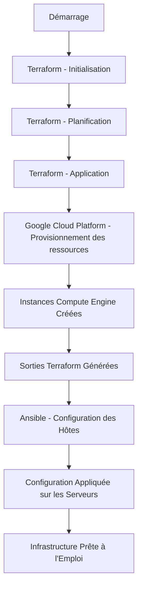

# Gestion d'Infrastructure avec Terraform et Ansible

## Description du Projet

Ce projet vise à automatiser le déploiement et la configuration d'une infrastructure cloud à l'aide de **Terraform** et **Ansible**. 
Il est structuré en deux parties principales :
- **Terraform** pour la gestion de l'infrastructure, incluant la provision de ressources sur Google Cloud Platform (GCP).
- **Ansible** pour la configuration des serveurs et des services.

Ce projet vise à automatiser le déploiement et la configuration d'une infrastructure cloud à l'aide de **Terraform** et **Ansible**. 
Il est structuré en deux parties principales :
- **Terraform** pour la gestion de l'infrastructure.
- **Ansible** pour la configuration des serveurs et des services.

## Structure du Projet

### Dossier Terraform
- `main.tf` : Fichier principal décrivant les ressources à provisionner.
- `providers.tf` : Définit les fournisseurs ( Google Cloud).
- `variables.tf` : Liste des variables nécessaires pour le déploiement.
- `terraform.tfvars` : Fichier contenant les valeurs des variables.
- `outputs.tf` : Spécifie les sorties après l'application de Terraform.
- `key.json` : Clé d'authentification pour le fournisseur cloud.

### Dossier Ansible
- `inventory.yml` : Liste des hôtes gérés par Ansible.
- `playbook.yml` : Décrit les tâches d'automatisation à exécuter sur les hôtes.
- `vars` : Variables nécessaires aux tâches définies dans le playbook.

## Exemple de Configuration Terraform

Voici un exemple de configuration Terraform utilisée pour provisionner une instance Compute Engine et un cluster Rancher 2 :

```hcl
resource "random_string" "unique_suffix" {
  length  = 8
  special = false
  upper   = false
}

resource "google_compute_instance" "rke2_node" {
  name         = "${var.instance_name}-${random_string.unique_suffix.result}"
  machine_type = "e2-medium"
  zone         = var.zone

  boot_disk {
    initialize_params {
      image = "ubuntu-2004-focal-v20231101"
      size  = 50
    }
  }

  network_interface {
    network = "default"
    access_config {}
  }

  metadata = {
    ssh-keys = "ubuntu:${file("~/.ssh/id_rsa.pub")}" 
  }
}

resource "rancher2_cluster" "imported_cluster" {
  name = "my-imported-cluster-${random_string.unique_suffix.result}"
}

resource "local_file" "terraform_outputs" {
  content = jsonencode({
    import_command = rancher2_cluster.imported_cluster.cluster_registration_token[0].command,
    instance_ip    = google_compute_instance.rke2_node.network_interface[0].access_config[0].nat_ip
  })
  filename = "${path.module}/../ansible/vars/terraform_output.json" # Ce fichier est utilisé par Ansible pour configurer les hôtes basés sur les sorties Terraform.
}
```

## Prérequis

- **Terraform** : Version >= 1.0
- **Ansible** : Version >= 2.9
- Accès à un fournisseur cloud (exemple : Google Cloud Platform).
- Authentification configurée via un fichier de clé (`key.json`).

## Instructions d'Utilisation

### Étape 1 : Initialisation et Déploiement avec Terraform
1. Naviguez vers le dossier `terraform` :
   ```bash
   cd terraform
   ```
2. Initialisez Terraform :
   ```bash
   terraform init
   ```
3. Planifiez le déploiement pour vérifier les changements :
   ```bash
   terraform plan
   ```
4. Appliquez les changements :
   ```bash
   terraform apply
   ```

### Étape 2 : Configuration des Serveurs avec Ansible
1. Naviguez vers le dossier `ansible` :
   ```bash
   cd ansible
   ```
2. Exécutez le playbook :
   ```bash
   ansible-playbook -i inventory.yml playbook.yml
   ```

## Schéma détaillé du flux de travail

